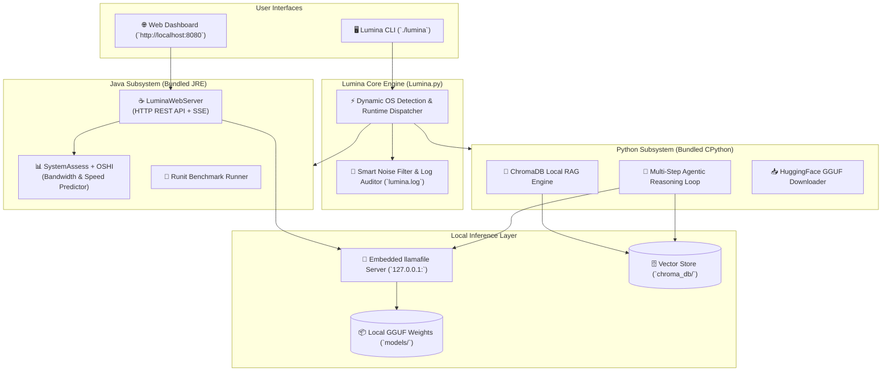

<div align="center">

```text
 ▒▒███                                   ▒▒▒                       
  ▒███        █████ ████ █████████████   ████  ████████    ██████  
  ▒███       ▒▒███ ▒███ ▒▒███▒▒███▒▒███ ▒▒███ ▒▒███▒▒███  ▒▒▒▒▒███ 
  ▒███        ▒███ ▒███  ▒███ ▒███ ▒███  ▒███  ▒███ ▒███   ███████ 
  ▒███      █ ▒███ ▒███  ▒███ ▒███ ▒███  ▒███  ▒███ ▒███  ███▒▒███ 
  ███████████ ▒▒████████ █████▒███ █████ █████ ████ █████▒▒████████
 ▒▒▒▒▒▒▒▒▒▒▒   ▒▒▒▒▒▒▒▒ ▒▒▒▒▒ ▒▒▒ ▒▒▒▒▒ ▒▒▒▒▒ ▒▒▒▒ ▒▒▒▒▒  ▒▒▒▒▒▒▒▒ 
```

# ⚡ Lumina AI Engine

**Enterprise-Grade Local AI Toolchain • Hardware-Aware Predictor • Offline RAG & Agentic Reasoning**

[](https://github.com)
[](https://github.com)
[](https://github.com)
[](https://github.com)
[](https://github.com)
[](LICENSE)

<p align="center">
  <a href="#-quick-start">🚀 Quick Start</a> •
  <a href="#-key-features">✨ Features</a> •
  <a href="#-system-architecture">📐 Architecture</a> •
  <a href="#-command-matrix">📖 Command Reference</a> •
  <a href="#-feature-showcase">💻 Deep Dives</a> •
  <a href="#-directory-structure">📁 Project Structure</a>
</p>

---

</div>

## 🌟 Overview

**Lumina** is a completely self-contained, enterprise-grade local AI toolchain designed to run state-of-the-art quantized GGUF Large Language Models locally with **zero external dependencies** and **zero environment configuration**.

By bundling its own isolated JRE and CPython runtimes, Lumina runs instantly out-of-the-box on macOS, Windows, and Linux. It pairs high-speed local inference with dynamic hardware memory bandwidth sensing, a local web dashboard & model store, and an offline Agentic RAG reasoning engine.

```text
 ✧･ﾟ: *✧･ﾟ:* ✧･ﾟ: *✧･ﾟ:* ✧･ﾟ: *✧･ﾟ:* ✧･ﾟ: *✧･ﾟ:*
 Lumina AI Engine — Enterprise CLI Toolchain
 ‾‾‾‾‾‾‾‾‾‾‾‾‾‾‾‾‾‾‾‾‾‾‾‾‾‾‾‾‾‾‾‾‾‾‾‾‾‾‾‾‾‾‾‾‾‾‾‾‾‾
 [Lumina] ❖ Platform:       macos
 [Lumina] ❖ Bundled JRE:    .../Jre/Mac-intel/jdk-25.0.4+7-jre/...
 [Lumina] ❖ Bundled Python: .../python-dependencies/macos-intel/bin/python3
 [Lumina] ❖ Log File:       .../logs/lumina.log

 Usage: lumina <command> [args...]
 ✧･ﾟ: *✧･ﾟ:* ✧･ﾟ: *✧･ﾟ:* ✧･ﾟ: *✧･ﾟ:* ✧･ﾟ: *✧･ﾟ:*
```

---

## ✨ Key Features

<table>
  <tr>
    <td width="50%">
      <h3>🔌 Zero-Config Portable Runtime</h3>
      <p>Bundles isolated JRE and CPython environments. Never worry about conflicting <code>JAVA_HOME</code>, <code>PATH</code>, or broken global pip packages.</p>
    </td>
    <td width="50%">
      <h3>⚡ Hardware Bandwidth Predictor</h3>
      <p>Directly queries physical memory bus throughput using OSHI to predict exact <b>tokens/sec</b> generation speed before running models.</p>
    </td>
  </tr>
  <tr>
    <td width="50%">
      <h3>🏪 Interactive Web Dashboard</h3>
      <p>Modern browser-based UI (<code>http://localhost:8080</code>) with model catalog, live download streaming, RAM estimation, and test IDE.</p>
    </td>
    <td width="50%">
      <h3>🚀 High-Speed Local Inference</h3>
      <p>Embedded, cross-platform <code>llamafile</code> engine running quantized <code>.gguf</code> weights with a drop-in OpenAI-compatible API.</p>
    </td>
  </tr>
  <tr>
    <td width="50%">
      <h3>🤖 Offline RAG & Agentic Reasoning</h3>
      <p>Private document ingestion, BGE semantic vector embeddings, ChromaDB vector store, and multi-step agentic reasoning loop.</p>
    </td>
    <td width="50%">
      <h3>🛡️ Enterprise Output & Auditing</h3>
      <p>Clean ANSI terminal UX with intelligent noise suppression and 100% full raw audit trails recorded to <code>logs/lumina.log</code>.</p>
    </td>
  </tr>
</table>

---

## 📐 System Architecture



---

## 🚀 Quick Start

Get up and running in seconds. No global compilers, runtimes, or pip installs needed.

### 1. Clone & Enter Directory
```bash
git clone https://github.com/choudharyowais473/Lumina.git
cd Lumina
```

### 2. Launch Lumina CLI

#### 🍎 macOS / 🐧 Linux
```bash
chmod +x lumina
./lumina
```

#### 🪟 Windows (Command Prompt / PowerShell)
```cmd
.\lumina.bat
```

### 3. Setup Default Models
Download pre-configured lightweight base GGUF models:
```bash
./lumina --setup
```

---

## 📖 Command Matrix

Lumina provides a unified CLI interface for managing all operations:

| Command | Category | Description | Example |
| :--- | :--- | :--- | :--- |
| **`--models`** | 🌐 Web UI | Spawns local Web Dashboard & Model Store | `./lumina --models` |
| **`--assess`** | 📊 Performance | Measures memory bandwidth & predicts tok/s | `./lumina --assess` |
| **`--bench`** | ⚡ Benchmark | Executes local hardware benchmark on GGUF models | `./lumina --bench` |
| **`--setup`** | 📥 Downloader | Pulls default base GGUF model weights | `./lumina --setup` |
| **`--launch`** | 🚀 Inference | Starts background model server (OpenAI API) | `./lumina --launch Llama-3.2-1B-Instruct-Q4_K_M` |
| **`--rag`** | 🤖 Knowledge | Ingests documents into local Chroma vector store | `./lumina --rag` |
| **`--agentic`** | 🧠 Agent | Runs multi-step Agentic RAG reasoning loop | `./lumina --agentic` |
| **`--download`** | 📥 Downloader | Downloads custom GGUF models from HuggingFace | `./lumina --download` |
| **`--install`** | 📦 Package | Installs packages into bundled Python runtime | `./lumina --install scikit-learn` |
| **`--dependencies`**| 📦 Package | Verifies & installs all core Python dependencies | `./lumina --dependencies` |

---

## 💻 Feature Showcase

### 1. 🌐 Interactive Web Dashboard (`--models`)
Spawns an asynchronous Java HTTP server serving a rich, responsive Web UI:
```bash
./lumina --models
```
- **Live URL**: `http://localhost:8080`
- **Model Store**: Browse, inspect VRAM/RAM requirements, and download new models.
- **Built-in IDE**: Test prompts and code completions in real-time.

```text
[Lumina Server] ✨ Lumina Web Server is live and running locally!
[Lumina Server] 👉 Access Web Dashboard at: http://localhost:8080
```

---

### 2. 📊 Hardware Sensing & Bandwidth Predictor (`--assess`)
Local LLM generation speed on CPU/unified memory is fundamentally bounded by memory bus bandwidth. Lumina directly calculates throughput:

$$\text{Memory Bandwidth (GB/s)} = \frac{\text{Model Size (GB)} \times \text{Tokens/sec}}{\text{Pass Count}}$$

$$\text{Estimated Model Footprint (GB)} = \text{Parameters (B)} \times \left(\frac{\text{Quantization Bits}}{8}\right)$$

```bash
./lumina --assess
```
```text
[Lumina Assess] 📊 Calculated True Bandwidth: 28.54 GB/s
[Lumina Assess] ⚡ Estimated tokens/sec for 1.5B Q4: 25.85 tok/s
[Lumina SystemAssess] ✔ SystemAssess completed successfully.
```

---

### 3. 🚀 OpenAI-Compatible Model Server (`--launch`)
Launches a high-performance local server with an OpenAI-compatible REST endpoint:

```bash
./lumina --launch Llama-3.2-1B-Instruct-Q4_K_M
```

You can now interact with it using standard tools and libraries:

```python
from openai import OpenAI

client = OpenAI(
    base_url="http://127.0.0.1:8080/v1",
    api_key="local-dev"
)

response = client.chat.completions.create(
    model="Llama-3.2-1B-Instruct-Q4_K_M",
    messages=[{"role": "user", "content": "Explain quantum computing in 2 sentences."}]
)
print(response.choices[0].message.content)
```

---

### 4. 🤖 Offline RAG & Agentic Reasoning (`--rag` & `--agentic`)
Query local private documents with zero cloud data transmission:

```bash
# 1. Ingest documents and build Chroma vector database
./lumina --rag

# 2. Execute multi-step iterative agent reasoning loop
./lumina --agentic
```
- **Embeddings**: Local HuggingFace BGE / miniLM embeddings.
- **Vector DB**: ChromaDB with cosine similarity search.
- **Traces**: Full step-by-step reasoning traces logged to `logs/Agentic.log`.

---

## 📁 Directory Structure

```text
Lumina/
├── 📜 Lumina.py               # Unified cross-platform CLI dispatcher
├── 🐚 lumina                  # CLI launcher script (macOS / Linux)
├── 🪟 lumina.bat              # CLI launcher script (Windows)
├── 📦 models/                 # Local GGUF model storage directory
├── 🐍 scripts/                # Python pipelines & launchers
│   ├── rag.py                 # Document ingestion & Chroma vector search
│   ├── agentic_rag.py         # Multi-step Agentic RAG reasoning loop
│   ├── launch_model.py        # Background llamafile server launcher
│   └── download_base_models.py# Base weights downloader
├── ☕ src/java/lumina/         # Core Java backend & Web Server
│   ├── LuminaWebServer.java   # HTTP server & API endpoints
│   ├── SystemAssess.java      # Hardware bandwidth sensor & speed predictor
│   └── Runit.java             # Hardware benchmark harness
├── 🎨 resources/              # Web assets & llamafile binaries
│   ├── web/                   # Web Dashboard UI (index.html, ide.html)
│   ├── llmstore.json          # Curated model catalog metadata
│   └── llamafile/             # Multi-platform llamafile binary
├── 📝 logs/                   # Full timestamped execution audit logs
│   └── lumina.log             # Primary engine diagnostics log
├── ☕ Jre/                    # Bundled JRE runtimes (macOS, Windows)
└── 🐍 python-dependencies/    # Bundled CPython runtimes (macOS, Windows)
```

---

## 🔍 Diagnostics & Auditing

Lumina suppresses compiler warnings, JVM deprecation noise, and SLF4J chatter from your terminal while capturing 100% of raw subprocess output into:

```text
logs/lumina.log
```

If an issue occurs, simply inspect `logs/lumina.log` or run:
```bash
tail -f logs/lumina.log
```

---

## 📚 Further Reading

- 📐 **[ARCHITECTURE.md](file:///Users/apple/Lumina/ARCHITECTURE.md)** — In-depth architectural breakdown, bandwidth formulas, and OS detection mechanics.
- 🔄 **[SWAPPABLE.md](file:///Users/apple/Lumina/SWAPPABLE.md)** — Guide to swapping GGUF weights, vector databases, inference backends, and runtimes.

---

## 🤝 Contributing

Contributions, issues, and feature requests are welcome! Feel free to check the [issues page](https://github.com/choudharyowais473/Lumina/issues).

1. Fork the Project
2. Create your Feature Branch (`git checkout -b feature/AmazingFeature`)
3. Commit your Changes (`git commit -m 'Add some AmazingFeature'`)
4. Push to the Branch (`git push origin feature/AmazingFeature`)
5. Open a Pull Request

---

## 📄 License

Distributed under the **Apache 2.0 License**. See [`LICENSE`](file:///Users/apple/Lumina/LICENSE) for more information.

<div align="center">
  <sub>Built with 💜 for local, private, high-performance AI.</sub>
</div>
