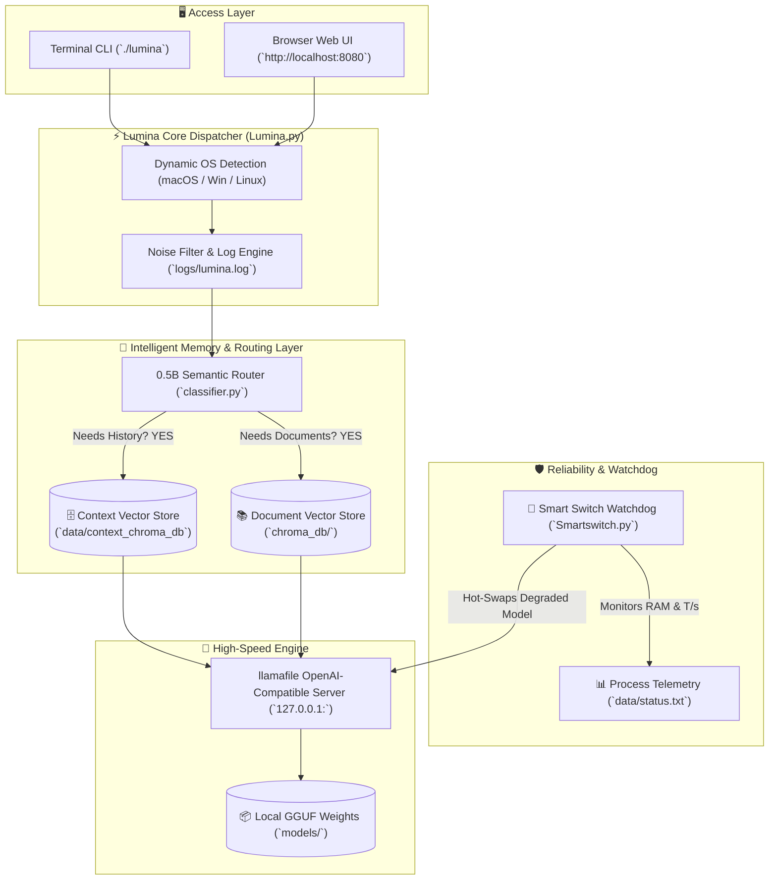

<div align="center">

```text
 ▒▒███                                   ▒▒▒                       
  ▒███        █████ ████ █████████████   ████  ████████    ██████  
  ▒███       ▒▒███ ▒███ ▒▒███▒▒███▒▒███ ▒▒███ ▒▒███▒▒███  ▒▒▒▒▒███ 
  ▒███        ▒███ ▒███  ▒███ ▒███ ▒███  ▒███  ▒███ ▒███   ███████ 
  ▒███      █ ▒███ ▒███  ▒███ ▒███ ▒███  ▒███  ▒███ ▒███  ███▒▒███ 
  ███████████ ▒▒████████ █████▒███ █████ █████ ████ █████▒▒████████
 ▒▒▒▒▒▒▒▒▒▒▒   ▒▒▒▒▒▒▒▒ ▒▒▒▒▒ ▒▒▒ ▒▒▒▒▒ ▒▒▒▒▒ ▒▒▒▒ ▒▒▒▒▒  ▒▒▒▒▒▒▒▒ 
```

# ⚡ Lumina AI Engine

**The Self-Healing, Zero-Config, Private Local AI Operating System**  
*Enterprise-Grade Inference • Autonomous Hot-Swapping • Hardware Bandwidth Sensing • Dual-Tier Intelligent Memory*

[](https://github.com)
[](https://github.com)
[](https://github.com)
[](https://github.com)
[](https://github.com)
[](LICENSE)

<p align="center">
  <a href="#-the-problem-why-is-running-local-ai-so-hard">🛑 The Pain Points</a> •
  <a href="#-how-lumina-solves-it">💡 How Lumina Solves It</a> •
  <a href="#-quick-start">🚀 Quick Start</a> •
  <a href="#-command-matrix">📖 Command Matrix</a> •
  <a href="#-system-architecture">📐 System Architecture</a> •
  <a href="#-feature-walkthroughs">💻 Deep Dives</a>
</p>

---

</div>

## 🛑 The Problem: Why is Running Local AI So Hard?

If you have ever tried running an AI model on your own computer, you have probably experienced how frustrating it can be:

### 1. 🤯 "Dependency Hell" (The Installation Nightmare)
> **The Pain Point**: You download an AI tool, and suddenly you get cryptic red errors: *"Python 3.12 is incompatible with PyTorch"*, *"CUDA drivers not found"*, *"Conflicting NumPy version"*, or *"JAVA_HOME is not set"*. You spend 3 hours fixing broken libraries instead of using AI.

### 2. 💥 The Silent Crash & "Out of Memory" (OOM) Freeze
> **The Pain Point**: You are in the middle of asking a complex question or analyzing a document. The AI runs out of RAM or GPU memory. Your computer freezes, the process crashes, the port disconnects, and whatever you were working on is completely lost.

### 3. 🧠 The "Amnesia" vs "Prompt Bloat" Dilemma
> **The Pain Point**: Most AI tools either **forget everything** the moment you start a new question, or they **blindly paste all your past conversations** into every single prompt. Pasting everything clogs the AI's brain, slows down generation to a crawl, and causes hallucinations.

### 4. 🔮 The Hardware Guesswork Trap
> **The Pain Point**: You download a 15GB model, wait an hour, launch it, and get **0.5 tokens per second** (one word every 5 seconds). You had no way of knowing beforehand whether your physical machine had the memory bus bandwidth to run it comfortably.

### 5. ☁️ Privacy Leaks & Cloud Dependency
> **The Pain Point**: Sending confidential business reports, private code, or personal documents to cloud APIs means your sensitive data leaves your machine and sits on someone else's servers.

---

## 💡 How Lumina Solves It

**Lumina** was built from the ground up to eliminate every single one of these pain points. It is not just an AI runner—it is a **resilient, self-healing, completely private AI toolchain** designed for anyone from beginners to enterprise teams.

```
┌────────────────────────────────────────────────────────────────────────────────────────┐
│                                   LUMINA AT A GLANCE                                   │
├─────────────────────────┬───────────────────────────────┬──────────────────────────────┤
│ 🛑 Old Way (Traditional)│ ⚡ Lumina Solution             │ 🎯 The Result                │
├─────────────────────────┼───────────────────────────────┼──────────────────────────────┤
│ Broken pip/Java setup   │ 🔌 Bundled JRE + CPython      │ Works instantly out-of-the-box│
│ Sudden crashes on high RAM│ 🔄 SmartSwitch Circuit Breaker│ Auto hot-swaps on same port  │
│ Forgetful or slow RAG   │ 🧠 0.5B Semantic Memory Gating│ Fast, dual-tier memory search│
│ Guessing model speeds   │ 📊 Physical Hardware Sensing  │ Accurate Speed & RAM forecast│
│ Cloud data leaks        │ 🛡️ 100% Offline & Air-Gapped  │ Total privacy & zero tracking│
└─────────────────────────┴───────────────────────────────┴──────────────────────────────┘
```

---

## ✨ Core Pillars of Lumina

### 1. 🔌 True Zero-Config Portability (Double-Click & Run)
Lumina bundles its own isolated **Java Runtime Environment (JRE)**, bundled **CPython runtimes**, and universal **`llamafile`** binaries directly inside the directory.
* **No `pip install` needed**.
* **No Java installation needed**.
* **No global system modifications**.
* Whether you are on **macOS (Intel/Apple Silicon)**, **Windows**, or **Linux**, Lumina detects your operating system and loads the exact right engine automatically.

---

### 2. 🔄 SmartSwitch: The Autonomous Self-Healing Circuit Breaker
In enterprise environments, downtime is unacceptable. Lumina features **SmartSwitch** (`scripts/Smartswitch.py`), an active watchdog that monitors running AI models in real time:
* **Tracks RAM Inflation**: If a model begins leaking memory past the safety threshold, SmartSwitch intervenes.
* **Tracks Speed Drops**: If generation speed drops by more than **25%** below baseline, SmartSwitch intervenes.
* **Same-Port Hot Swap**: SmartSwitch terminates the degraded model, recycles the TCP socket, and launches an ultra-fast fallback model (`Qwen2.5-0.5B-Instruct`) on the **exact same port**. Your apps, web browsers, and scripts never lose their connection!
* **Automated Context Preservation**: Before the swap finishes, SmartSwitch automatically saves and vectorizes your conversation history into Chroma DB so no thoughts are lost.

---

### 3. 🧠 Dual-Tier Intelligent Memory & Dynamic 0.5B Routing
Lumina solves the "Amnesia vs Prompt Bloat" problem using an intelligent two-tier memory system:
* **The 0.5B Router**: When you ask a question, Lumina's fast 0.5B model checks your intent in milliseconds:
  * 📄 *Asking a standalone question?* (e.g. *"What is photosynthesis?"*) $\rightarrow$ Retrieves only relevant document chunks. Keeps inference lightning-fast.
  * 🧠 *Asking about past discussion?* (e.g. *"What did we agree on earlier?"*) $\rightarrow$ Retrieves relevant conversation memory vectors from `data/context_chroma_db`.
* **Explicit Control (`--context`)**: Save context when you want to; embed it into vector storage whenever you choose with `lumina --embed`.

---

### 4. 📊 Physical Hardware Sensing (`SystemAssess`)
Lumina doesn't guess your computer's speed—it calculates it using physical memory bus benchmarks:

$$\text{Memory Bandwidth (GB/s)} = \frac{\text{Model Size (GB)} \times \text{Tokens/sec}}{\text{Pass Count}}$$

$$\text{Estimated Model Footprint (GB)} = \text{Parameters (B)} \times \left(\frac{\text{Quantization Bits}}{8}\right)$$

Before you even download or run a model, Lumina can tell you your computer's **true memory bandwidth** and predict the exact **tokens per second** you will achieve.

---

## 📐 System Architecture



---

## 🚀 Quick Start

### 1. Clone & Enter Directory
```bash
git clone https://github.com/choudharyowais473/Lumina.git
cd Lumina
```

### 2. Launch Lumina CLI

#### 🍎 macOS / 🐧 Linux
```bash
chmod +x lumina
./lumina
```

#### 🪟 Windows (Command Prompt / PowerShell)
```cmd
.\lumina.bat
```

### 3. Setup Default Models
Download pre-configured base GGUF weights:
```bash
./lumina --setup
```

---

## 📖 Complete Command & Combination Matrix

Lumina provides a unified CLI with versatile arguments and flag combinations:

| Primary Command | Sub-Flags / Arguments | Category | Description | Exact Example |
| :--- | :--- | :--- | :--- | :--- |
| **`--models`** | _None_ | 🌐 Web UI | Spawns local Web Dashboard & Model Store at `localhost:8080` | `./lumina --models` |
| **`--rag`** | _[file_path]_ | 🤖 Knowledge | Runs document RAG on default or specific document | `./lumina --rag data/sample.txt` |
| **`--rag`** | **`--context`** _[file]_ | 🧠 Memory | Runs Document RAG + **live conversation tracking** | `./lumina --rag --context data/sample.txt` |
| **`--context`** | _[file_path]_ | 🧠 Memory | Shortcut to launch RAG with active conversation tracking | `./lumina --context data/sample.txt` |
| **`--context`** | **`--embed`** / **`--embedd`** | 🗄️ Memory | Vectorizes accumulated `model_context/context` into Chroma DB | `./lumina --context --embed` |
| **`--embed`** | _None_ | 🗄️ Memory | Standalone command to embed conversation context into vector DB | `./lumina --embed` |
| **`--switch`** | _None_ | 🔄 Watchdog | Runs Smart Switch watchdog with default fallback & 25% RAM limit | `./lumina --switch` |
| **`--switch`** | _[FallbackModel]_ _[RAM_limit]_ | 🔄 Watchdog | Runs Smart Switch with custom fallback model & custom RAM allowance | `./lumina --switch Qwen2.5-0.5B-Instruct-Q4_K_M 0.25` |
| **`--launch`** | _[ModelName]_ | 🚀 Server | Spawns local OpenAI-compatible server for designated model | `./lumina --launch Llama-3.2-1B-Instruct-Q4_K_M` |
| **`--launch`** | _[ModelName]_ _[Port]_ | 🚀 Server | Spawns local OpenAI-compatible server on specific port | `./lumina --launch Qwen2.5-0.5B-Instruct-Q4_K_M 8080` |
| **`--agentic`** | _[file_path]_ | 🧠 Agent | Runs multi-step iterative Agentic RAG reasoning loop | `./lumina --agentic data/sample.txt` |
| **`--assess`** | _None_ | 📊 Hardware | Measures physical memory bus bandwidth & predicts tok/s | `./lumina --assess` |
| **`--bench`** | _None_ | ⚡ Benchmark | Executes local hardware benchmark across GGUF models | `./lumina --bench` |
| **`--download`**| _[ModelID]_ | 📥 Downloader | Interactive or direct HuggingFace GGUF model downloader | `./lumina --download` |
| **`--setup`** | _None_ | 📥 Downloader | Automatically downloads pre-configured base GGUF weights | `./lumina --setup` |
| **`--install`** | _<pkg1> [pkg2 ...]_ | 📦 Package | Installs specific packages into the bundled Python environment | `./lumina --install scikit-learn pandas` |
| **`--dependencies`**| _None_ | 📦 Setup | Verifies & installs all core Python dependencies in bundled env | `./lumina --dependencies` |

---

## 🎛️ Flag Combinations & Usage Cheatsheet

### 1. RAG & Memory Combinations
```bash
# 1. Standard Document RAG (uses default data/sample.txt)
./lumina --rag

# 2. Document RAG on a custom document
./lumina --rag data/financial_report.txt

# 3. Document RAG WITH live context recording enabled
./lumina --rag --context data/financial_report.txt

# 4. Shortcut for context-enabled RAG
./lumina --context data/financial_report.txt

# 5. Manual context vectorization (embeds model_context/context to Chroma DB)
./lumina --context --embed
# OR
./lumina --embed
```

### 2. SmartSwitch Watchdog Combinations
```bash
# 1. Launch default watchdog (fallback: Qwen2.5-0.5B, RAM allowance: 25%)
./lumina --switch

# 2. Custom fallback model with custom RAM threshold (e.g. 30% allowance)
./lumina --switch Qwen2.5-0.5B-Instruct-Q4_K_M 0.30
```

### 3. Model Server & OpenAI Endpoint Combinations
```bash
# 1. Launch default model on dynamic available port
./lumina --launch Qwen2.5-0.5B-Instruct-Q4_K_M

# 2. Launch model explicitly binding to port 8080
./lumina --launch Llama-3.2-1B-Instruct-Q4_K_M 8080
```

### 4. Agentic Reasoning & Knowledge Processing
```bash
# 1. Run multi-step agentic analysis on default document
./lumina --agentic

# 2. Run multi-step agentic analysis on custom document
./lumina --agentic data/research_paper.txt
```

### 5. Dependency & Package Management
```bash
# 1. Verify and install all foundational dependencies
./lumina --dependencies

# 2. Install one or more custom packages into bundled CPython
./lumina --install matplotlib seaborn
```

---

## 💻 Feature Walkthroughs

### 1. 🌐 The Web Dashboard (`--models`)
Launch a local browser-based UI to browse models, inspect memory requirements, and test prompts in an interactive IDE:
```bash
./lumina --models
```
* **Dashboard URL**: `http://localhost:8080`
* **Features**: Live model catalog, one-click downloads, RAM sizing visualizer, and live prompt testing.

---

### 2. 🧠 Intelligent Dual-Tier RAG (`--context` & `--embed`)
Query your private documents while retaining long-term project memory:

```bash
# Start an interactive conversation with memory recording enabled
./lumina --context
```

**How It Works Behind the Scenes**:
1. You ask: *"Where was Albert Einstein born?"*
   * 🤖 **Router**: Standalone question $\rightarrow$ Searches only document text.
   * 💬 **Answer**: *"Albert Einstein was born in Ulm, Germany on March 14, 1879."*
2. Later, you ask: *"What did we discuss earlier about solar inverters?"*
   * 🤖 **Router**: Detected reference to past discussion $\rightarrow$ Retrieves vectorized chunks from `data/context_chroma_db`.
   * 💬 **Answer**: *"We discussed designing an autonomous solar inverter with 98% efficiency using SiC MOSFETs."*

---

### 3. 🔄 SmartSwitch Auto-Failover (`--switch`)
Run the autonomous guardian in the background while interacting with your models:
```bash
./lumina --switch Qwen2.5-0.5B-Instruct-Q4_K_M 0.25
```
```text
[Lumina Smartswitch] 🚀 Smart Switch started. Fallback Model: 'Qwen2.5-0.5B-Instruct-Q4_K_M' | RAM allowance: 25.0%
[Lumina Smartswitch] ⚠️ Speed degradation detected for 'Llama-3.2-1B': baseline=24.50 T/s -> current=15.20 T/s (< 75%)
[Lumina Smartswitch] 🧠 Smart Switch: Embedding session context into Chroma DB for seamless continuity...
[Lumina Smartswitch] 🚨 Triggering Smart Switch! Replacing with fallback on same port 51308...
[Lumina Smartswitch] ✔ Successfully switched to 'Qwen2.5-0.5B-Instruct-Q4_K_M' on port 51308!
```

---

### 4. 🚀 OpenAI-Compatible Local Server (`--launch`)
Plug Lumina into any standard AI tool, IDE extension (Cursor, Continue, VS Code), or Python script:

```bash
./lumina --launch Qwen2.5-0.5B-Instruct-Q4_K_M
```

```python
from openai import OpenAI

client = OpenAI(
    base_url="http://127.0.0.1:8080/v1",
    api_key="lumina-local"
)

response = client.chat.completions.create(
    model="Qwen2.5-0.5B-Instruct-Q4_K_M",
    messages=[{"role": "user", "content": "Explain quantum computing in one sentence."}]
)
print(response.choices[0].message.content)
```

---

## 📁 Project Directory Structure

```text
Lumina/
├── 📜 Lumina.py               # Unified cross-platform CLI dispatcher & noise filter
├── 🐚 lumina                  # Fast CLI launcher for macOS / Linux
├── 🪟 lumina.bat              # Fast CLI launcher for Windows
├── 📦 models/                 # Local GGUF model storage directory
├── 🐍 scripts/                # High-efficiency Python modules
│   ├── classifier.py          # 0.5B Semantic router & context vectorizer
│   ├── Smartswitch.py         # Smart Switch watchdog & same-port fallback monitor
│   ├── rag.py                 # Dual-source Document + Context RAG pipeline
│   ├── agentic_rag.py         # Multi-step Agentic reasoning loop
│   ├── launch_model.py        # Background llamafile server launcher
│   └── download_base_models.py# Base weights downloader
├── ☕ src/java/lumina/         # High-throughput Java backend
│   ├── LuminaWebServer.java   # Local Web Dashboard server & REST API
│   ├── SystemAssess.java      # Physical memory bandwidth & speed predictor
│   └── Runit.java             # Hardware benchmark harness
├── 🎨 resources/              # Web UI assets & universal llamafile binaries
├── 📝 logs/                   # Clean, timestamped audit logs (lumina.log)
├── 💾 model_context/          # Stored conversational context files
├── ☕ Jre/                    # Bundled zero-config JRE runtimes (macOS, Windows)
└── 🐍 python-dependencies/    # Bundled zero-config CPython runtimes (macOS, Windows)
```

---

## 🔍 Auditing & Diagnostics

Lumina uses an **enterprise-grade noise filter**. All noisy compilation chatter, JVM warnings, and dependency notices are suppressed from your terminal screen to give you a clean UI, while **100% of raw diagnostics are captured** in:

```text
logs/lumina.log
```

To view live diagnostics in another terminal window:
```bash
tail -f logs/lumina.log
```

---

## 🤝 Contributing

Contributions, feature requests, and feedback are welcome!
1. Fork the Repository
2. Create your Feature Branch (`git checkout -b feature/MyFeature`)
3. Commit your Changes (`git commit -m 'Add MyFeature'`)
4. Push to the Branch (`git push origin feature/MyFeature`)
5. Open a Pull Request

---

## 📄 License

Distributed under the **Apache 2.0 License**. See [`LICENSE`](file:///Users/apple/Lumina/LICENSE) for details.

<div align="center">
  <sub>Built with 💜 for private, resilient, high-performance local AI.</sub>
</div>
