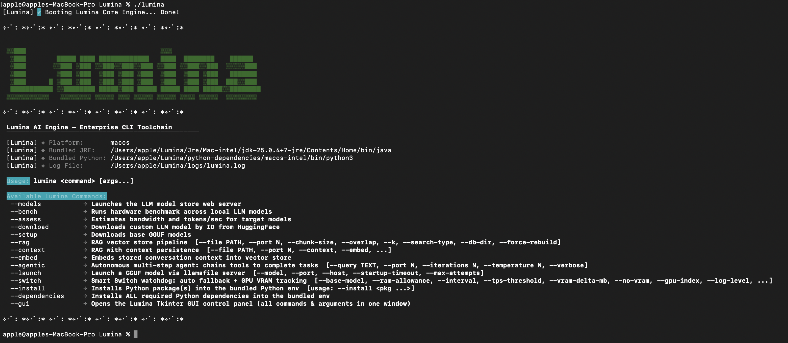
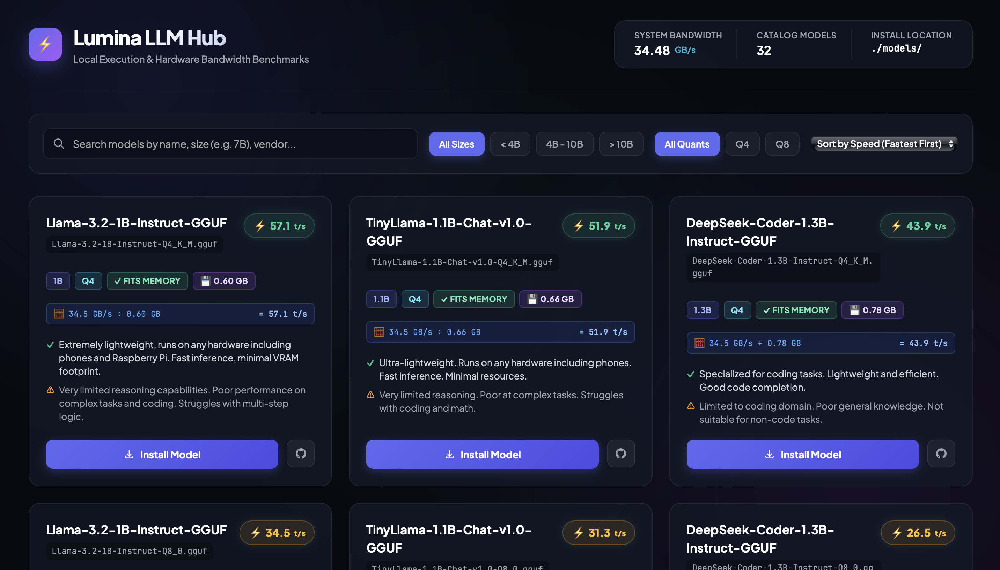
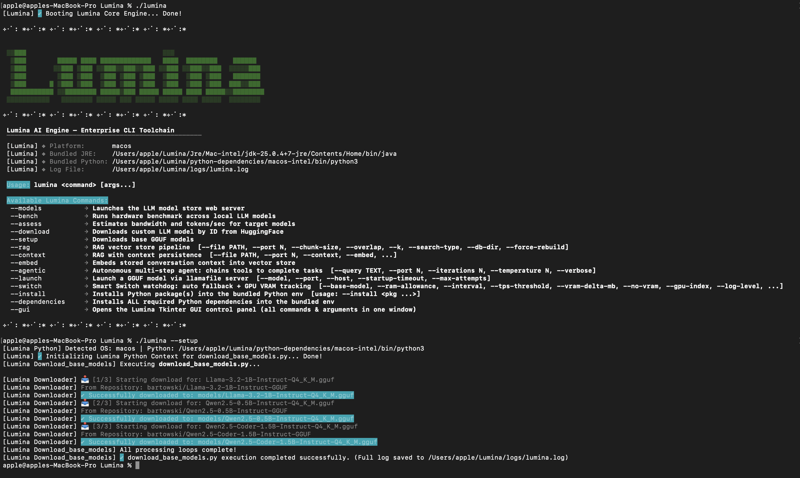
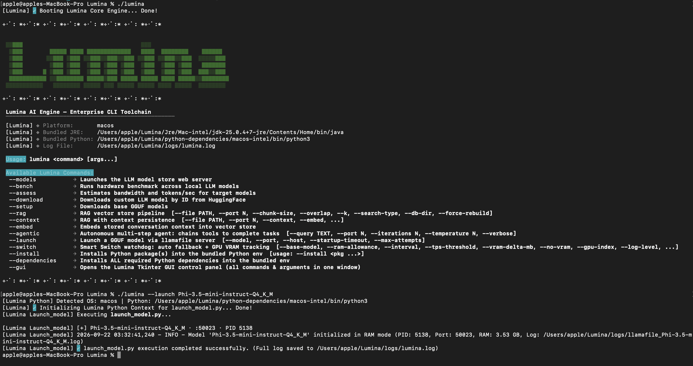
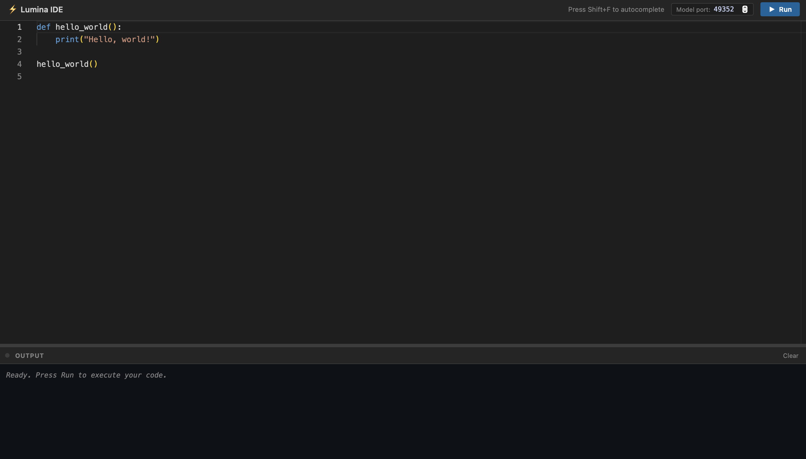
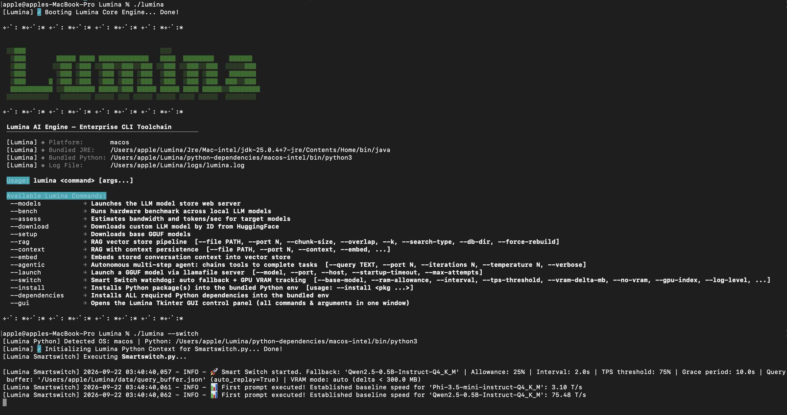
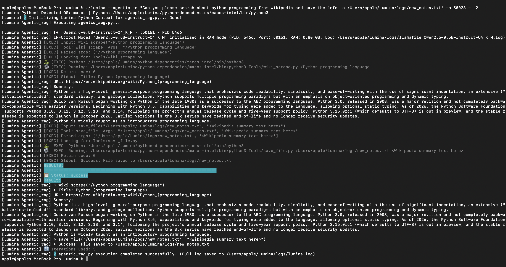
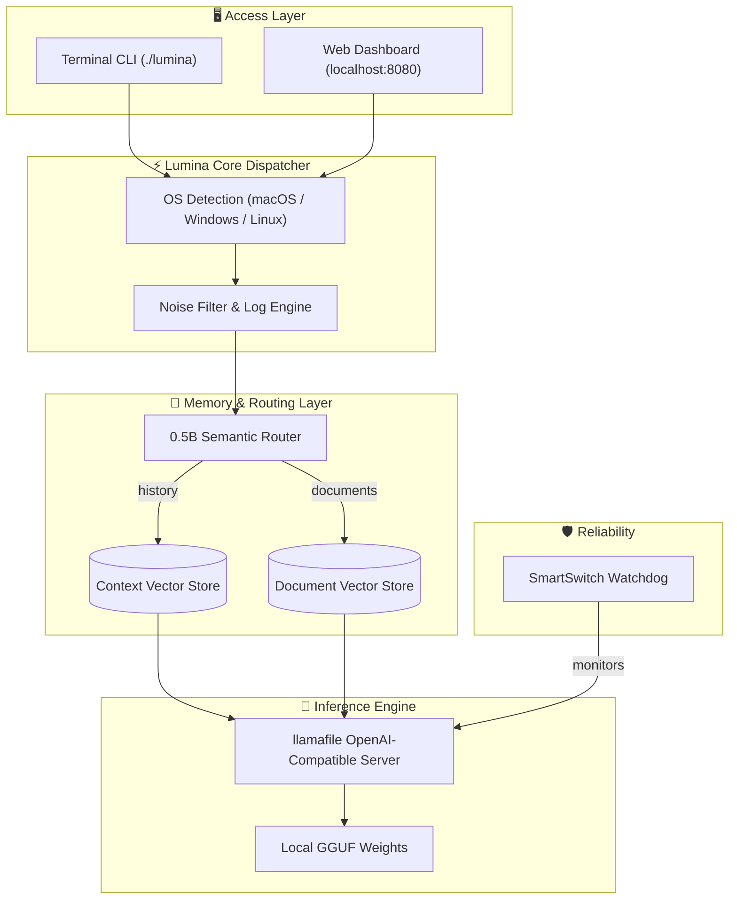

<h1 align="center" style="border-bottom: none">
  <div>
    ⚡ Lumina
    <br>
    <sub>The Self-Healing, Zero-Config, Private Local AI Operating System</sub>
  </div>
</h1>

<p align="center">
<b>Lumina is an open-source, fully offline toolchain for running, benchmarking, and building on local LLMs.</b>
It bundles its own Java runtime, Python runtime, and inference engine, so it runs on macOS, Windows, and Linux without any dependency setup — no cloud calls, no accounts, no data ever leaving your machine.
</p>

<div align="center">

[](https://github.com/Uwais-ML/Lumina)
[](https://github.com/Uwais-ML/Lumina)
[](https://github.com/Uwais-ML/Lumina)
[](https://github.com/Uwais-ML/Lumina)
[](https://github.com/Uwais-ML/Lumina/blob/main/LICENSE)

</div>

<p align="center">
  <a href="#-what-is-lumina"><b>🚀 What is Lumina?</b></a> •
  <a href="#-quick-start"><b>⚡ Quick Start</b></a> •
  <a href="#-how-lumina-compares"><b>📊 How Lumina Compares</b></a> •
  <a href="#-frequently-asked-questions"><b>❓ FAQ</b></a> •
  <a href="#-command--flag-matrix"><b>📖 Command Matrix</b></a> •
  <a href="#-feature-walkthroughs"><b>💻 Feature Walkthroughs</b></a> •
  <a href="#-fully-swappable"><b>🔄 Swappable Components</b></a> •
  <a href="#-system-architecture"><b>📐 Architecture</b></a> •
  <a href="#-contributing"><b>🤝 Contributing</b></a>
</p>

<br>

<p align="center">
  
</p>

---

<a id="-what-is-lumina"></a>
## 🚀 What is Lumina?

Running local AI today usually means dependency hell, silent OOM crashes, models that forget everything between sessions, and no way to know if your hardware can even run the model you just downloaded. **Lumina** was built to remove every one of those blockers in a single, self-contained toolchain.

Its core capabilities:

- **🔌 Zero-config portability** — bundles its own JRE, CPython runtime, and `llamafile` binaries. Clone it, run `./lumina`, and it detects your OS and loads the right engine. No `pip install`, no Java setup, no global changes.
- **🔄 SmartSwitch self-healing watchdog** — monitors running models for RAM inflation and speed degradation in real time, and hot-swaps a failing model for a lightweight fallback **on the same port**, so your app never loses connection.
- **🧠 Dual-tier intelligent memory** — a fast 0.5B router classifies every query as a standalone question or a reference to past discussion, and pulls from the right vector store (document RAG vs. conversation memory) instead of stuffing everything into the prompt.
- **📊 Physical hardware sensing** — benchmarks your machine's real memory bandwidth and predicts tokens/sec for any model *before* you download or run it.
- **🤖 Agentic tool execution** — an autonomous multi-step agent that chains together drop-in Python tools (file I/O, web scraping, package installs, arbitrary code) to complete a task end to end.
- **🚀 OpenAI-compatible local server** — launch any GGUF model behind a `v1/chat/completions` endpoint and plug it into Cursor, Continue, or any OpenAI SDK client.
- **🌐 Web dashboard & IDE** — a local model store, hardware benchmark visualizer, and a built-in code editor with autocomplete, all served from `localhost:8080`.
- **🔄 Fully swappable internals** — every component (models, inference engine, vector DB, embeddings, runtimes, UI, backend routes) is a drop-in replacement, not a hard-coded dependency. See [Swappable Components](#-fully-swappable) below.

> **Why this matters:** Lumina isn't a wrapper around a hosted API — the entire stack (runtime, inference server, memory layer, watchdog, and web UI) runs on your machine, licensed under Apache-2.0, with nothing to configure and nothing to send off-device.

<p align="center">
  
</p>

<br>

<a id="-quick-start"></a>
## ⚡ Quick Start

Clone the repository and enter the directory:

```bash
git clone https://github.com/Uwais-ML/Lumina.git
cd Lumina
```

Launch the CLI — macOS / Linux:

```bash
chmod +x lumina
./lumina
```

Launch the CLI — Windows:

```powershell
.\lumina.bat
```

Download the pre-configured base GGUF models:

```bash
./lumina --setup
```

<p align="center">
  
</p>

Talk to a model right away:

```bash
./lumina --launch Qwen2.5-0.5B-Instruct-Q4_K_M
```

<p align="center">
  
</p>

```python
from openai import OpenAI

client = OpenAI(base_url="http://127.0.0.1:8080/v1", api_key="lumina-local")

response = client.chat.completions.create(
    model="Qwen2.5-0.5B-Instruct-Q4_K_M",
    messages=[{"role": "user", "content": "Explain quantum computing in one sentence."}]
)
print(response.choices[0].message.content)
```

<br>

<a id="-how-lumina-compares"></a>
## 📊 How Lumina Compares

| Pain point with traditional local-AI setups | ⚡ Lumina's approach | 🎯 Result |
|---|---|---|
| Broken `pip`/Java installs, version conflicts | Bundled JRE + bundled CPython, auto-detected per OS | Works instantly, out of the box |
| Sudden crashes when RAM/VRAM runs out | SmartSwitch watchdog with same-port hot-swap | No dropped connections, no lost work |
| Forgetful chat or slow, bloated RAG | 0.5B semantic router + dual-tier vector memory | Fast answers, relevant context only |
| Guessing whether a model will run well | Physical hardware bandwidth sensing (`--assess`) | Accurate tokens/sec forecast before you download |
| Cloud APIs seeing your data | 100% offline, air-gapped execution | Full privacy, zero telemetry |

<br>

<a id="-frequently-asked-questions"></a>
## ❓ Frequently Asked Questions

#### Is Lumina open source?
Yes. Lumina is licensed under Apache 2.0, and the entire toolchain — CLI, watchdog, memory layer, web dashboard, and Java backend — is free to run and modify.

#### Does Lumina need an internet connection?
Only to download model weights the first time (`--setup` or `--download`). Inference, RAG, the agent, and the web dashboard all run fully offline afterward.

#### What model formats does Lumina support?
GGUF weights served through `llamafile`, with an OpenAI-compatible `v1/chat/completions` endpoint so any OpenAI SDK client or IDE extension can connect.

#### What happens if a model crashes or runs out of memory?
The SmartSwitch watchdog (`./lumina --switch`) detects RAM inflation or a speed drop below threshold, saves and vectorizes the session context, and swaps in a fallback model on the same port automatically.

#### Can I add my own tools for the agent to use?
Yes. Drop a `.py` file into `Tools/` with a function signature and docstring in the first 6 lines — the agent auto-discovers it on the next run.

<br>

<a id="-command--flag-matrix"></a>
## 📖 Command & Flag Matrix

| Command | Sub-flags | Category | Description | Example |
|---|---|---|---|---|
| `--models` | — | 🌐 Web UI | Launches the local model store & dashboard | `./lumina --models` |
| `--setup` | — | 📥 Downloader | Downloads pre-configured base GGUF weights | `./lumina --setup` |
| `--download` | `[ModelID]` | 📥 Downloader | Downloads a custom model by ID from HuggingFace | `./lumina --download` |
| `--assess` | — | 📊 Hardware | Estimates bandwidth & tokens/sec for target models | `./lumina --assess` |
| `--bench` | — | ⚡ Benchmark | Runs a hardware benchmark across local models | `./lumina --bench` |
| `--rag` | `[file]` `--context` | 🤖 Knowledge | Document RAG, optionally with live context tracking | `./lumina --rag --context data/sample.txt` |
| `--context` | `[file]` `--embed` | 🧠 Memory | Shortcut for context-enabled RAG / vectorizes context | `./lumina --context --embed` |
| `--embed` | — | 🗄️ Memory | Standalone command to embed conversation context | `./lumina --embed` |
| `--launch` | `[model]` `[port]` | 🚀 Server | Spawns an OpenAI-compatible local server | `./lumina --launch Llama-3.2-1B-Instruct-Q4_K_M` |
| `--switch` | `[fallback]` `[RAM %]` | 🔄 Watchdog | Runs the SmartSwitch self-healing watchdog | `./lumina --switch Qwen2.5-0.5B-Instruct-Q4_K_M 0.25` |
| `--agentic` | `-q` `-p` `-i` `--verbose` | 🤖 Agent | Autonomous multi-step agent that chains tools | `./lumina --agentic -q "Save PyTorch info to a file" -i 10` |
| `--install` | `[pkg ...]` | 📦 Package | Installs packages into the bundled Python env | `./lumina --install pandas scikit-learn` |
| `--dependencies` | — | 📦 Setup | Installs all required Python dependencies | `./lumina --dependencies` |
| `--gui` | — | 🖥️ Control Panel | Opens the Tkinter GUI with every command in one window | `./lumina --gui` |

Full flag combinations and cheatsheets are documented in [`ARCHITECTURE.md`](ARCHITECTURE.md).

<br>

<a id="-feature-walkthroughs"></a>
## 💻 Feature Walkthroughs

### 🌐 Web Dashboard & built-in IDE

```bash
./lumina --models
```

Browse the local model catalog, check RAM/VRAM fit before downloading, and test prompts directly in the built-in editor — all served from `localhost:8080`, fully offline.

<p align="center">
  
</p>

### 🧠 Dual-tier memory in action

```bash
./lumina --context
```

- Ask *"Where was Albert Einstein born?"* → the 0.5B router detects a standalone question and searches document text only.
- Later ask *"What did we discuss earlier about solar inverters?"* → the router detects a reference to past discussion and retrieves vectorized context from `data/context_chroma_db` instead.

### 🔄 SmartSwitch self-healing

```bash
./lumina --switch Qwen2.5-0.5B-Instruct-Q4_K_M 0.25
```

```
[Lumina Smartswitch] 🚀 Smart Switch started. Fallback: 'Qwen2.5-0.5B-Instruct-Q4_K_M' | Allowance: 25%
[Lumina Smartswitch] ⚠️ Speed degradation detected: baseline=24.50 T/s -> current=15.20 T/s (< 75%)
[Lumina Smartswitch] 🧠 Embedding session context into Chroma DB for continuity...
[Lumina Smartswitch] ✔ Switched to 'Qwen2.5-0.5B-Instruct-Q4_K_M' on the same port!
```

<p align="center">
  
</p>

### 🤖 Agentic tool execution

```bash
./lumina --agentic -q "Search Wikipedia for Python programming and save it to a file" -p 50023 -i 2
```

The agent classifies whether the query needs tools, discovers available tools by scanning `Tools/`, decides which to call, executes each one with the bundled Python runtime, and feeds results back into the loop until the task is marked `DONE`.

<p align="center">
  
</p>

<br>

<a id="-system-architecture"></a>
## 📐 System Architecture



Full component-level detail lives in [`ARCHITECTURE.md`](ARCHITECTURE.md).

<br>

## 📁 Project Structure

```
Lumina/
├── Lumina.py               # Cross-platform CLI dispatcher
├── lumina / lumina.bat     # Fast launchers (macOS/Linux, Windows)
├── models/                 # Local GGUF model storage
├── scripts/                # classifier.py, Smartswitch.py, rag.py, agentic_rag.py, launch_model.py
├── Tools/                  # Drop-in tools auto-discovered by the agent
├── src/java/lumina/        # Java backend (web server, hardware assessment)
├── resources/              # Web UI assets & llamafile binaries
├── logs/                   # Timestamped audit logs
├── Jre/                    # Bundled JRE runtimes
└── python-dependencies/    # Bundled CPython runtimes
```

<br>

<a id="-contributing"></a>
## 🤝 Contributing

Contributions, feature requests, and feedback are welcome.

1. Fork the repository
2. Create your feature branch: `git checkout -b feature/MyFeature`
3. Commit your changes: `git commit -m 'Add MyFeature'`
4. Push to the branch: `git push origin feature/MyFeature`
5. Open a Pull Request

<br>

## 📄 License

Distributed under the **Apache 2.0 License**. See [`LICENSE`](LICENSE) for details.

<p align="center"><sub>Built for private, resilient, high-performance local AI.</sub></p>
